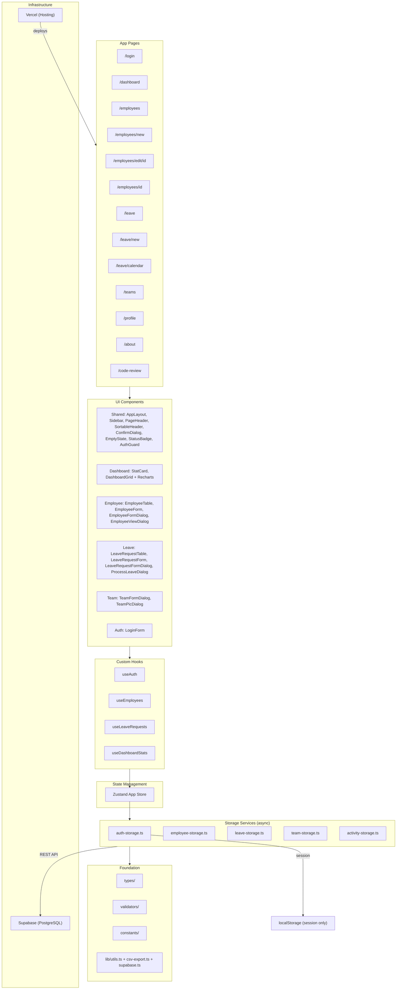

# Employee Leave Management System — Implementation Plan (Updated)

## Overview

Aplikasi web menggunakan **Next.js 16 App Router** untuk mengelola data karyawan dan pengajuan cuti. Data disimpan di **Supabase (PostgreSQL)** dan di-deploy ke **Vercel**.

> [!IMPORTANT]
> Tech stack yang digunakan:
> - Next.js 16 App Router + TypeScript (strict)
> - Tailwind CSS + ShadCN UI v4 (BaseUI)
> - React Hook Form + Zod Validation
> - Zustand (Global State Management)
> - DOMPurify (XSS Sanitization)
> - date-fns (Date Utilities)
> - **Supabase** (Database — PostgreSQL)
> - **Vercel** (Deployment)

---

## Status Legend

| Emoji | Status |
|-------|--------|
| ✅ | Sudah Terimplementasi |
| 🔧 | Sudah Terimplementasi + Enhancement (melebihi spec) |
| ❌ | Belum Terimplementasi |
| 🆕 | Enhancement baru (belum ada di plan awal) |

---

## Phase 1: Project Foundation ✅

| Item | Status | Keterangan |
|------|--------|------------|
| Next.js Project Setup (App Router) | ✅ | TypeScript strict |
| ShadCN UI v4 Init + Components | ✅ | button, card, input, label, select, table, dialog, toast, badge, alert-dialog, form, skeleton, textarea, dropdown-menu, separator, navigation-menu |
| Global Layout & Theming | ✅ | Inter font, dark/light theme, globals.css |
| Path Aliases (`@/`) | ✅ | |

---

## Phase 2: Type Definitions & Validation ✅

### Types

| File | Status | Keterangan |
|------|--------|------------|
| `src/types/employee.ts` | 🔧 | Extended: `email`, `role` (ADMIN/EMPLOYEE), `joinDate`, `leaveBalance`, `status` (ACTIVE/INACTIVE) — melebihi spec awal |
| `src/types/leave-request.ts` | 🔧 | Extended: `type` (ANNUAL/SICK/UNPAID/MATERNITY/IMPORTANT), `durationDays`, `createdAt`, `approvedBy`, `approvedAt`, `approverFeedback`, `attachment`, `CANCELLED` status |
| `src/types/auth.ts` | 🔧 | Extended: `identifier` (username/email), `userId`, `role`, `expiresAt` (session expiry) |

### Validators

| File | Status | Keterangan |
|------|--------|------------|
| `src/validators/employee-validator.ts` | ✅ | name (min 3), department, position, email, joinDate |
| `src/validators/leave-request-validator.ts` | 🔧 | + attachment (optional object), endDate > startDate refinement |
| `src/validators/auth-validator.ts` | 🔧 | `identifier` (bukan hanya username) |

---

## Phase 3: Constants & Utilities ✅

| File | Status | Keterangan |
|------|--------|------------|
| `src/constants/index.ts` | 🔧 | STORAGE_KEYS, ROUTES, DEPARTMENTS, AUTH_CREDENTIALS, ACTIVITY_LOGS key |
| `src/lib/utils.ts` | ✅ | cn() utility |
| `src/lib/csv-export.ts` | 🆕 | CSV Export utility untuk Leave Requests & Employees |
| `src/lib/supabase.ts` | 🆕 | Supabase client singleton |

---

## Phase 4: Service Layer ✅ (Migrated to Supabase)

> [!IMPORTANT]
> Semua service layer telah di-migrasi dari localStorage ke **Supabase (PostgreSQL)**.
> Semua method sekarang `async/await` untuk komunikasi database.

| File | Status | Keterangan |
|------|--------|------------|
| `src/services/employee-storage.ts` | 🔧 | CRUD via Supabase + getByEmail + search (async) |
| `src/services/leave-storage.ts` | 🔧 | + `feedback`, `calculateDuration()`, leave balance via Supabase (async) |
| `src/services/auth-storage.ts` | 🔧 | + admin username login, session expiry (2 jam), localStorage session |
| `src/services/activity-storage.ts` | 🆕 | Audit trail logging via Supabase (async) |
| `src/services/team-storage.ts` | 🆕 | CRUD Teams + PIC management via Supabase (async) |

---

## Phase 5: State Management & Custom Hooks ✅

| File | Status | Keterangan |
|------|--------|------------|
| `src/store/app-store.ts` | 🆕 | Zustand global store — cache employees & leaveRequests in-memory |
| `src/hooks/use-auth.ts` | 🔧 | + `isAdmin` flag, RBAC-aware |
| `src/hooks/use-employees.ts` | 🔧 | Zustand-backed + activity logging + `isLoading` |
| `src/hooks/use-leave-requests.ts` | 🔧 | Zustand-backed + activity logging + RBAC filter (employee hanya lihat milik sendiri) + `feedback` parameter |
| `src/hooks/use-dashboard-stats.ts` | 🔧 | + recent activities |

---

## Phase 6: Shared Components ✅

| File | Status | Keterangan |
|------|--------|------------|
| `src/components/shared/AppLayout.tsx` | ✅ | Layout wrapper |
| `src/components/shared/Sidebar.tsx` | 🔧 | Sidebar nav (desktop collapsible + mobile hamburger drawer) + active indicator + logout + theme toggle |
| `src/components/shared/PageHeader.tsx` | ✅ | Title + optional action button |
| `src/components/shared/ConfirmDialog.tsx` | ✅ | Reusable AlertDialog |
| `src/components/shared/EmptyState.tsx` | ✅ | Icon + message + action |
| `src/components/shared/SearchInput.tsx` | ✅ | Search dengan debounce |
| `src/components/shared/StatusBadge.tsx` | ✅ | Color-coded status badge |
| `src/components/shared/AuthGuard.tsx` | ✅ | Client-side auth guard + loading state |
| `src/components/shared/SortableHeader.tsx` | 🆕 | Reusable komponen sorting (Asc/Desc) untuk semua tabel |
| `src/components/shared/PageTransition.tsx` | 🆕 | Animasi transisi antar halaman |

---

## Phase 7: Authentication Module ✅

| File | Status | Keterangan |
|------|--------|------------|
| `src/components/auth/LoginForm.tsx` | 🔧 | Split-screen layout, glassmorphism, gradient accents, responsive |
| `src/app/login/page.tsx` | ✅ | Premium design, redirect jika sudah login |

> [!WARNING]
> Credentials disimpan di `auth-storage.ts` — error messages tidak menampilkan hint credentials.

---

## Phase 8: Dashboard Module ✅

| File | Status | Keterangan |
|------|--------|------------|
| `src/components/dashboard/StatCard.tsx` | ✅ | Icon + title + value + color + trend |
| `src/components/dashboard/DashboardGrid.tsx` | 🔧 | Admin: 4 stat cards + **BarChart + PieChart** + filterable leave list. Employee: Leave Balance + Upcoming Leaves |
| `src/app/dashboard/page.tsx` | ✅ | Auth guard + responsive + skeleton loading |

---

## Phase 9: Employee Management Module ✅

| File | Status | Keterangan |
|------|--------|------------|
| `src/components/employee/EmployeeTable.tsx` | 🔧 | + pagination + CSV export + sortable columns + responsive (overflow-x-auto, hidden columns on mobile) |
| `src/components/employee/EmployeeForm.tsx` | ✅ | Create/Edit mode, RHF + Zod |
| `src/components/employee/EmployeeFormDialog.tsx` | 🆕 | Dialog-based employee create/edit |
| `src/components/employee/EmployeeViewDialog.tsx` | 🆕 | Dialog detail view employee |
| `src/app/employees/page.tsx` | 🔧 | + skeleton loading |
| `src/app/employees/new/page.tsx` | ✅ | |
| `src/app/employees/[id]/page.tsx` | ✅ | Detail view + leave history |
| `src/app/employees/edit/[id]/page.tsx` | ✅ | Load by ID, 404 handling |

---

## Phase 10: Leave Request Module ✅

| File | Status | Keterangan |
|------|--------|------------|
| `src/components/leave/LeaveRequestTable.tsx` | 🔧 | + pagination + CSV export + sortable columns + responsive + ProcessLeaveDialog |
| `src/components/leave/LeaveStatusFilter.tsx` | ✅ | ALL/PENDING/APPROVED/REJECTED |
| `src/components/leave/LeaveRequestForm.tsx` | 🔧 | + file attachment (Base64, max 500KB), auto-fill employee for non-admin, DOMPurify sanitization |
| `src/components/leave/LeaveRequestFormDialog.tsx` | 🆕 | Dialog-based leave request creation |
| `src/components/leave/ProcessLeaveDialog.tsx` | 🆕 | Dialog approve/reject + overlap detection + feedback |
| `src/app/leave/page.tsx` | 🔧 | Tabbed view: List + Calendar, responsive toggle buttons |
| `src/app/leave/new/page.tsx` | ✅ | |
| `src/app/leave/calendar/page.tsx` | 🆕 | Calendar view untuk leave requests |

---

## Phase 11: App Configuration ✅

| File | Status | Keterangan |
|------|--------|------------|
| `src/app/layout.tsx` | ✅ | SEO metadata, Inter font, Toaster, ThemeProvider |
| `src/app/page.tsx` | ✅ | Root redirect |
| `src/app/error.tsx` | 🆕 | Global Error Boundary (pesan generik, tanpa stack trace) |
| `next.config.ts` | 🔧 | CSP headers (`connect-src` untuk Supabase API) |

---

## Phase 12: Extra Pages & Modules

| File | Status | Keterangan |
|------|--------|------------|
| `src/app/profile/page.tsx` | 🆕 | Halaman profil + leave balance + data management (admin) |
| `src/app/about/page.tsx` | 🆕 | Halaman tentang aplikasi |
| `src/app/code-review/page.tsx` | 🆕 | Halaman code review |
| `src/app/teams/page.tsx` | 🆕 | Teams management + PIC assignment + sortable columns |
| `src/components/team/TeamFormDialog.tsx` | 🆕 | Dialog create/edit team |
| `src/components/team/TeamPicDialog.tsx` | 🆕 | Dialog assign PIC ke team |
| `src/types/team.ts` | 🆕 | Type definition untuk Team |

---

## Phase 13: Database Migration (Supabase) ✅

> [!IMPORTANT]
> Migrasi penuh dari localStorage ke Supabase PostgreSQL

| Item | Status | Keterangan |
|------|--------|------------|
| DDL Schema + Seed Data | ✅ | `database/supabase_migration.sql` |
| Supabase Client | ✅ | `src/lib/supabase.ts` (singleton) |
| Service Layer Async Migration | ✅ | Semua service method sekarang `async/await` |
| CSP Fix | ✅ | `connect-src 'self' https://*.supabase.co` |
| Tabel: `employees`, `leave_requests`, `teams`, `activity_logs` | ✅ | Lengkap dengan foreign keys & indexes |

---

## Phase 14: Responsive Design ✅

| Item | Status | Keterangan |
|------|--------|------------|
| Mobile Sidebar (Hamburger) | ✅ | Drawer slide-out, hanya hamburger di top bar |
| Tables: overflow-x-auto | ✅ | Horizontal scroll di mobile |
| Hidden columns on mobile | ✅ | Kolom tersembunyi + info fallback di kolom utama |
| Calendar responsive | ✅ | Cell lebih kecil, hari disingkat (S M T W T F S) |
| Login page responsive | ✅ | Split-screen desktop, single-column mobile |

---

## Phase 15: Security Hardening ✅

| Item | Status | Keterangan |
|------|--------|------------|
| Login error message | ✅ | Pesan generik "Email atau password salah" (tanpa hint credentials) |
| Error page | ✅ | Pesan generik tanpa `error.message` / stack trace |
| Toast error messages | ✅ | Pesan generik pada semua catch blocks |
| Input placeholder | ✅ | Tidak lagi menampilkan "admin" sebagai placeholder |

---

## Enhancements Beyond Original Spec (Summary)

Fitur-fitur berikut **sudah terimplementasi** namun **tidak tercantum** di implementation plan awal:

| # | Enhancement | File Terkait |
|---|-------------|-------------|
| 1 | **Zustand State Management** — In-memory cache global, eliminasi redundant localStorage reads | `store/app-store.ts` |
| 2 | **Audit Trail / Activity Log** — Logging CRUD operations, tampil di Dashboard | `services/activity-storage.ts`, `DashboardGrid.tsx` |
| 3 | **RBAC (Role-Based Access Control)** — Admin vs Employee separation. Employee hanya bisa lihat cuti mereka sendiri | `use-auth.ts`, `use-leave-requests.ts`, `AuthGuard.tsx` |
| 4 | **Session Expiry** — Sesi login kadaluarsa setelah 2 jam | `auth-storage.ts` |
| 5 | **Skeleton Loading** — Loading placeholder UI di Dashboard, Employee table, dan Leave table | Semua pages |
| 6 | **Global Error Boundary** — Graceful crash handling, tombol "Try Again" | `app/error.tsx` |
| 7 | **CSV Export** — Download data Employee dan Leave Request sebagai CSV | `lib/csv-export.ts` |
| 8 | **Pagination** — Tabel employee dan leave request memakai paginasi (10 item/page) | `EmployeeTable.tsx`, `LeaveRequestTable.tsx` |
| 9 | **Leave Type** — ANNUAL, SICK, UNPAID, MATERNITY, IMPORTANT | `leave-request.ts` |
| 10 | **Duration Calculation** — Hitung hari kerja (exclude weekend) via `date-fns` | `leave-storage.ts` |
| 11 | **Leave Balance** — Deduct saat approve ANNUAL, refund saat reject/cancel | `leave-storage.ts` |
| 12 | **Approver Feedback** — Komentar opsional saat approve/reject | `ProcessLeaveDialog.tsx` |
| 13 | **Document Attachment** — Upload file pendukung (PDF/Image, max 500KB) saat mengajukan cuti | `LeaveRequestForm.tsx` |
| 14 | **Overlap Detection** — Peringatan otomatis jika ada karyawan lain cuti di tanggal yang sama | `ProcessLeaveDialog.tsx` |
| 15 | **DOMPurify Input Sanitization** — Cegah XSS pada field reason | `LeaveRequestForm.tsx` |
| 16 | **Calendar View** — Tampilan kalender untuk leave requests | `/leave/calendar` |
| 17 | **Profile Page** — Halaman profil pengguna | `/profile` |
| 18 | **Teams Management** — CRUD teams + assign PIC leave approver | `/teams`, `TeamFormDialog`, `TeamPicDialog` |
| 19 | **Supabase Migration** — Full migrasi dari localStorage ke PostgreSQL | `supabase.ts`, semua services |
| 20 | **Sortable Table Columns** — Sorting Asc/Desc di semua tabel | `SortableHeader.tsx` |
| 21 | **Responsive Design** — Mobile-first layout, hidden columns, hamburger menu | Semua komponen |
| 22 | **Security Hardening** — Hapus credential hints, generic error messages | `LoginForm`, `error.tsx` |
| 23 | **About & Code Review Pages** — Halaman informasi dan review | `/about`, `/code-review` |
| 24 | **Recharts Dashboard** — BarChart + PieChart untuk visualisasi data cuti | `DashboardGrid.tsx` |
| 25 | **Vercel Deployment** — Deploy ke Vercel dengan auto-deploy dari GitHub | `vercel.com` |

---

## Potential Future Improvements ❌ (Belum Terimplementasi)

| # | Feature | Priority | Description | Status |
|---|---------|----------|-------------|--------|
| 1 | ~~Dark/Light Mode Toggle~~ | ~~Medium~~ | ~~Tombol switch tema~~ | ✅ Sudah |
| 2 | **Notification Bell** | Low | Badge notifikasi real-time (WebSocket/Supabase Realtime) | ❌ |
| 3 | ~~Dashboard Charts~~ | ~~Low~~ | ~~Grafik pie/bar chart~~ | ✅ Sudah |
| 4 | ~~Leave Balance Widget~~ | ~~Medium~~ | ~~Widget sisa cuti~~ | ✅ Sudah |
| 5 | ~~Cancel Leave Request~~ | ~~Medium~~ | ~~Employee cancel cuti PENDING~~ | ✅ Sudah |
| 6 | **Edit Leave Request** | Low | Employee edit cuti PENDING | ❌ |
| 7 | ~~Leave History per Employee~~ | ~~Medium~~ | ~~Riwayat cuti per karyawan~~ | ✅ Sudah |
| 8 | **Public Holiday Config** | Low | Hari libur nasional di-exclude dari durasi | ❌ |
| 9 | **Leave Balance per Type** | Low | Kuota terpisah per jenis cuti | ❌ |
| 10 | ~~CSP Headers~~ | ~~Medium~~ | ~~Content Security Policy~~ | ✅ Sudah |
| 11 | **Rate Limiting** | Low | Throttle login attempts | ❌ |
| 12 | ~~Data Export/Import~~ | ~~Low~~ | ~~Backup/restore data~~ | ✅ Sudah |
| 13 | **Email Notifications** | Medium | Kirim email saat cuti di-approve/reject | ❌ |
| 14 | **Supabase Auth** | Medium | Ganti auth manual ke Supabase Auth | ❌ |

---

## Phase 16: Audit Fixes & Improvements ✅ (Selesai)

> [!IMPORTANT]
> Temuan lengkap didokumentasikan di [audit_findings.md](file:///C:/Users/901110/Documents/Fanny/Belajar/vibe-coder/audit_findings.md)

### Batch 1 — Bug Fixes (Prioritas Tinggi)

#### Fix 1: Cascade Delete Leave Requests saat Hapus Employee
- **File:** `src/services/employee-storage.ts` → `deleteEmployee()`
- **Masalah:** Saat Admin menghapus Employee, leave request miliknya **tetap ada** → tampil "Unknown Employee"
- **Solusi:** Di `deleteEmployee()`, sebelum menghapus employee, panggil `LeaveStorageService` untuk menghapus semua leave request milik employee tersebut
- **Status:** `[x]` Selesai

#### Fix 2: Cegah Duplikasi Cuti di Tanggal yang Sama
- **File:** `src/services/leave-storage.ts` → `createLeaveRequest()`
- **Masalah:** Employee bisa submit cuti berkali-kali di tanggal yang overlap
- **Solusi:** Tambahkan validasi — jika employee sudah punya leave request (PENDING/APPROVED) yang overlap tanggalnya, tolak pengajuan baru
- **Status:** `[x]` Selesai

#### Fix 3: Cegah Admin Menghapus Diri Sendiri
- **File:** `src/components/employee/EmployeeTable.tsx`
- **Masalah:** Admin bisa menghapus akunnya sendiri → sesi invalid, crash
- **Solusi:** Sembunyikan/disable tombol Delete jika `employee.id === currentUser.userId`
- **Status:** `[x]` Selesai

#### Fix 4: Employee Bisa Cancel Cuti PENDING Sendiri
- **File:** `src/components/leave/LeaveRequestTable.tsx`, `src/hooks/use-leave-requests.ts`
- **Masalah:** Setelah submit, Employee tidak punya cara membatalkan cuti yang masih PENDING
- **Solusi:** Tambahkan tombol "Cancel" di baris tabel untuk leave request PENDING milik sendiri (bukan milik orang lain)
- **Status:** `[x]` Selesai

---

### Batch 2 — UX/Navigation Improvements (Prioritas Sedang)

#### Fix 5: Tambah Link Calendar di Navbar
- **File:** `src/components/shared/Navbar.tsx`
- **Masalah:** Halaman `/leave/calendar` ada tapi tidak bisa diakses dari Navbar
- **Solusi:** Tambahkan sub-item "Calendar" di bawah "Leave Requests" di navigation array
- **Status:** `[x]` Selesai

#### Fix 6: Tambah Route Constants yang Hilang
- **File:** `src/constants/index.ts`
- **Masalah:** `LEAVE_CALENDAR` dan `PROFILE` belum ada di ROUTES
- **Solusi:** Tambahkan `LEAVE_CALENDAR: "/leave/calendar"` dan `PROFILE: "/profile"`
- **Status:** `[x]` Selesai

#### Fix 7: Dashboard Employee View — Sisa Cuti & Upcoming Leaves
- **File:** `src/components/dashboard/DashboardGrid.tsx`
- **Masalah:** Employee hanya lihat 3 stat card tanpa info sisa cuti
- **Solusi:** Untuk Employee view, tambahkan Card "Leave Balance" dan list "Upcoming Leaves"
- **Status:** `[x]` Selesai

#### Fix 8: Notifikasi Badge PENDING di Navbar
- **File:** `src/components/shared/Navbar.tsx`
- **Masalah:** Admin tidak tahu ada berapa leave request PENDING tanpa membuka halaman
- **Solusi:** Tampilkan badge angka PENDING di samping ikon "Leave Requests"
- **Status:** `[x]` Selesai

---

### Batch 3 — Fitur Tambahan (Prioritas Rendah)

#### Fix 9: Riwayat Cuti per Employee
- **Masalah:** Tidak ada cara melihat riwayat cuti lengkap per karyawan
- **Solusi:** Halaman detail Employee menampilkan profil + daftar leave request mereka
- **Status:** `[x]` Selesai

#### Fix 10: Konfirmasi Unsaved Form
- **Masalah:** Data form hilang tanpa peringatan jika user navigasi keluar
- **Solusi:** Tambahkan `beforeunload` event atau prompt konfirmasi
- **Status:** `[x]` Selesai

#### Fix 11: Data Export/Import (Backup & Restore)
- **Masalah:** Semua data hilang jika clear browser
- **Solusi:** Tombol export (download JSON) dan import (restore dari JSON) di Profile/Settings
- **Status:** `[x]` Selesai

---

## Architecture Diagram (Updated)



---

## Complete File List (Updated)

| # | Path | Type | Status |
|---|------|------|--------|
| 1 | `src/types/employee.ts` | Type | ✅ Enhanced |
| 2 | `src/types/leave-request.ts` | Type | ✅ Enhanced |
| 3 | `src/types/auth.ts` | Type | ✅ Enhanced |
| 4 | `src/validators/employee-validator.ts` | Zod Schema | ✅ |
| 5 | `src/validators/leave-request-validator.ts` | Zod Schema | ✅ Enhanced |
| 6 | `src/validators/auth-validator.ts` | Zod Schema | ✅ Enhanced |
| 7 | `src/constants/index.ts` | Constants | ✅ Enhanced |
| 8 | `src/lib/utils.ts` | Utility | ✅ |
| 9 | `src/lib/csv-export.ts` | Utility | 🆕 |
| 10 | `src/store/app-store.ts` | Zustand Store | 🆕 |
| 11 | `src/services/auth-storage.ts` | Service | ✅ Enhanced |
| 12 | `src/services/employee-storage.ts` | Service | ✅ |
| 13 | `src/services/leave-storage.ts` | Service | ✅ Enhanced |
| 14 | `src/services/activity-storage.ts` | Service | 🆕 |
| 15 | `src/hooks/use-auth.ts` | Hook | ✅ Enhanced |
| 16 | `src/hooks/use-employees.ts` | Hook | ✅ Enhanced |
| 17 | `src/hooks/use-leave-requests.ts` | Hook | ✅ Enhanced |
| 18 | `src/hooks/use-dashboard-stats.ts` | Hook | ✅ Enhanced |
| 19 | `src/components/shared/AppLayout.tsx` | Component | ✅ |
| 20 | `src/components/shared/Navbar.tsx` | Component | ✅ |
| 21 | `src/components/shared/PageHeader.tsx` | Component | ✅ |
| 22 | `src/components/shared/ConfirmDialog.tsx` | Component | ✅ |
| 23 | `src/components/shared/EmptyState.tsx` | Component | ✅ |
| 24 | `src/components/shared/SearchInput.tsx` | Component | ✅ |
| 25 | `src/components/shared/StatusBadge.tsx` | Component | ✅ |
| 26 | `src/components/shared/AuthGuard.tsx` | Component | ✅ |
| 27 | `src/components/auth/LoginForm.tsx` | Component | ✅ Enhanced |
| 28 | `src/components/dashboard/StatCard.tsx` | Component | ✅ |
| 29 | `src/components/dashboard/DashboardGrid.tsx` | Component | ✅ Enhanced |
| 30 | `src/components/employee/EmployeeTable.tsx` | Component | ✅ Enhanced |
| 31 | `src/components/employee/EmployeeForm.tsx` | Component | ✅ |
| 32 | `src/components/leave/LeaveRequestTable.tsx` | Component | ✅ Enhanced |
| 33 | `src/components/leave/LeaveStatusFilter.tsx` | Component | ✅ |
| 34 | `src/components/leave/LeaveRequestForm.tsx` | Component | ✅ Enhanced |
| 35 | `src/components/leave/ProcessLeaveDialog.tsx` | Component | 🆕 |
| 36 | `src/components/theme-provider.tsx` | Component | 🆕 |
| 37 | `src/app/layout.tsx` | Page | ✅ |
| 38 | `src/app/page.tsx` | Page | ✅ |
| 39 | `src/app/error.tsx` | Page | 🆕 |
| 40 | `src/app/login/page.tsx` | Page | ✅ |
| 41 | `src/app/dashboard/page.tsx` | Page | ✅ |
| 42 | `src/app/employees/page.tsx` | Page | ✅ Enhanced |
| 43 | `src/app/employees/new/page.tsx` | Page | ✅ |
| 44 | `src/app/employees/edit/[id]/page.tsx` | Page | ✅ |
| 45 | `src/app/leave/page.tsx` | Page | ✅ Enhanced |
| 46 | `src/app/leave/new/page.tsx` | Page | ✅ |
| 47 | `src/app/leave/calendar/page.tsx` | Page | 🆕 |
| 48 | `src/app/profile/page.tsx` | Page | 🆕 |

**Total: 48 files** (dari rencana awal 40 files → bertambah 8 files enhancement)

---

## Verification Plan

### Build & Deploy Verification ✅

```bash
npm run build  # ✅ PASS — 0 errors, 15 pages generated
npm run dev    # ✅ Running on localhost:3000
```

**Deployment:** Vercel (auto-deploy dari GitHub `shin-ai/employee-leave-system`)

### Manual Test Cases

| Test Case | Status | Expected Result |
|-----------|--------|-----------------|
| Login admin | ✅ | Redirect ke `/dashboard` |
| Login employee | ✅ | Redirect ke `/dashboard` |
| Login credentials salah | ✅ | Pesan generik (tanpa hint) |
| Dashboard admin | ✅ | 4 stat cards + BarChart + PieChart + leave list |
| Dashboard employee | ✅ | Leave Balance + Upcoming Leaves |
| Skeleton loading | ✅ | Placeholder saat data loading |
| Tambah employee | ✅ | Validasi + tersimpan ke Supabase |
| Edit employee | ✅ | Data ter-load + update ke Supabase |
| Delete employee | ✅ | Cascade delete leave requests |
| Search employee | ✅ | Filter real-time |
| Sort tabel | ✅ | Asc/Desc per kolom (semua tabel) |
| Tambah leave request | ✅ | Validasi + tersimpan ke Supabase |
| Approve/Reject leave | ✅ | Dialog + overlap detection + feedback |
| Cancel leave (employee) | ✅ | Hanya PENDING milik sendiri |
| Employee view own leave | ✅ | RBAC filter |
| Teams CRUD | ✅ | Create/Edit/Delete team + PIC management |
| CSV Export | ✅ | Download file .csv |
| Pagination | ✅ | 10 items/page |
| Logout | ✅ | Session dihapus + redirect |
| Akses tanpa login | ✅ | Redirect ke `/login` |
| Responsive layout | ✅ | Mobile hamburger, hidden columns, scroll |
| Refresh halaman | ✅ | Data persist dari Supabase |
| Error boundary | ✅ | Pesan generik (tanpa stack trace) |
| About & Code Review page | ✅ | Halaman informasi lengkap |
